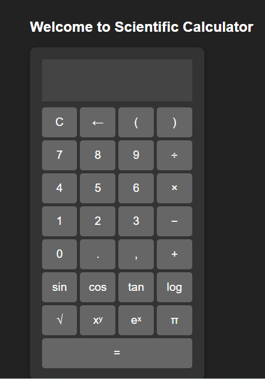

# 🔢 Scientific Calculator

A simple and responsive scientific calculator web app built using **HTML**, **CSS**, and **JavaScript**. It performs both basic arithmetic and advanced scientific calculations.

## 🚀 Features

- Basic operations: `+`, `-`, `×`, `÷`
- Scientific functions: `sin`, `cos`, `tan`, `log`, `√`, `^`, `π`, `e^x` , `x^y`
- Responsive design for both desktop and mobile

## 🛠️ Tech Stack

- **HTML** – Markup and structure
- **CSS** – Styling and layout
- **JavaScript** – Functionality and logic

## 📸 Screenshot

